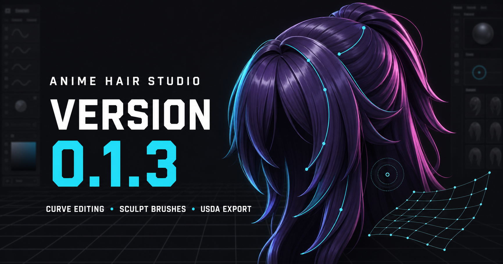

# Anime Hair Studio



Anime Hair Studio is a browser-based 3D modeling tool for designing stylized and anime-inspired hairstyles. It combines editable strand curves, procedural hair geometry, drawing and sculpting tools, live-surface guides, references, materials, and export tools in an artist-focused interface.

> **Development status:** Anime Hair Studio is an early work in progress. Projects should be backed up regularly, and experimental tools may change between versions.

## Highlights

- Draw editable strands, split panels, procedural braids, coils, and clumps.
- Shape hair with curve control points, proportional editing, hierarchy editing, and sculpt-style Move and Smooth brushes.
- Insert, remove, rebuild, and evenly redistribute curve control points while preserving the authored shape.
- Draw against the reference head, a contextual 2D plane, Capsule Guides, or Curve Lattice Guides.
- Organize hair by scalp region, display layer, clump, material, and linked mirror instance.
- Create open Hair Cards or closed volumetric strands with editable profiles and width/depth curves.
- Use 2D viewport overlays and transformable 3D reference planes, including cropping and view-specific visibility.
- Preview topology, UVs, materials, and anime-style anisotropic shading directly in the viewport.
- Save reusable strand, braid, profile, and curve presets.
- Export meshes and editable center curves for use in other 3D applications.

## Current release

The current build is **1.0.0**. See the [1.0 release notes](./docs/RELEASE_NOTES_1.0.0.md) and [release checklist](./docs/RELEASE_CHECKLIST.md). Packaging and publication are separate from this version update.

Version **1.0.0** adds curve lattice meshes and guides, editable pattern brushes, mesh bevel workflows, selection-only OBJ export, customizable shortcuts, and Low/Medium/High Effort remeshing.

Earlier release notes remain available in [PATCH_NOTES_0.1.5.txt](./PATCH_NOTES_0.1.5.txt).

## Requirements

- Windows 10 or Windows 11
- A current Chromium-based browser
- [Node.js](https://nodejs.org/) available as `node.exe`

An internet connection is currently required to load Three.js from unpkg. The local save service does not make this build fully offline.

The local service has no npm runtime dependencies. Development verification uses pinned ESLint dependencies: install them with `pnpm install --frozen-lockfile`, then run `pnpm test` (or `scripts/verify-project.ps1`). The verifier includes all discovered test files.

## Getting started

1. Download or clone the repository.
2. Double-click **`Start Anime Hair Studio.cmd`**.
3. The launcher starts the local service and opens Anime Hair Studio in your browser.

The launcher searches ports `5173` through `5189` and reuses an existing healthy Anime Hair Studio server when possible.

Opening `index.html` directly is not recommended. The interface will load, but native save and export functionality requires the local HTTP service.

The save service accepts only its local HTTP origins. If replacing a file fails, the original is not deleted; a completed `.saving-<id>` recovery file is retained beside it and its path is shown in the error. Keep that recovery copy until you have recovered or verified your project.

### Start without opening a browser

```powershell
powershell.exe -NoProfile -ExecutionPolicy Bypass -File ".\Start Anime Hair Studio.ps1" -NoOpen
```

The command prints the local URL after the service is ready.

### Start the server manually

```powershell
node server.js
```

Then open [http://127.0.0.1:5173/](http://127.0.0.1:5173/).

To use a different port:

```powershell
$env:PORT = "5174"
node server.js
```

## Essential controls

| Input | Action |
|---|---|
| `Q` / `W` / `E` / `R` | Select, Move, Rotate, and Scale |
| `T` | Relax curve points |
| `D` / `P` / `G` | Draw Strand, Split Panel, and Braid |
| `Ctrl` + click / drag | Add to the selection in applicable selection modes |
| `Shift` + click / drag | Remove from the selection in applicable selection modes |
| `Ctrl` + `Alt` + click | Insert a curve point while preserving the curve |
| `Shift` + `Alt` + click | Remove a curve point while preserving the curve |
| `Ctrl+D` | Duplicate the current selection |
| `Shift` while drawing | Constrain the stroke to 45-degree directions |
| `S` + left-drag | Resize the active brush |
| `B` | Toggle proportional editing |
| `H` | Toggle hierarchy editing |
| `X` | Toggle X-axis mirror editing |
| `O` | Toggle World and Object transform space |
| `F` | Cycle between framing the selection and the complete scene |
| `Alt` + left-drag | Orbit the camera |
| `Delete` | Delete the current removable selection |
| `Ctrl+Z` / `Ctrl+Y` | Undo and Redo |

The complete shortcut reference is available under **Help → Shortcuts**.
Tool and workspace keys can be customized under **Settings → Keyboard Shortcuts**; the table above lists defaults.

## Project and export formats

| Format | Purpose |
|---|---|
| `.ahs` | Native Anime Hair Studio project |
| `.animehair.json` | Legacy project format; supported when opening older projects |
| `.obj` | Mesh and center-curve polyline export; importer support for polylines varies |
| `.usda` | Mesh and editable center-curve export |

OBJ head meshes can also be imported as modeling references.

Export All includes hidden strands/meshes. Export Selection includes the selected objects even when hidden; visibility is not an export exclusion filter.

USDA export includes selectable content categories. Bones and skin weights are reserved for future authoring support and are currently unavailable.

## Preferences and backups

Browser storage keeps preferences and custom presets between sessions. The Preferences window can also download them as a portable JSON backup and restore them later.

Useful display options include:

- Control-point display size
- Compact viewport tool buttons
- Outliner folder colors
- Viewport or character-perspective Left/Right naming
- Default hair shader

Project files and preference backups serve different purposes. Save both when moving work between browsers or computers.

## Development

Run the project verification suite after making source changes:

```powershell
npm test
```

or:

```powershell
powershell.exe -NoProfile -ExecutionPolicy Bypass -File ".\scripts\verify-project.ps1"
```

The verifier checks reusable geometry and state helpers, localization, DOM contracts, JavaScript syntax, and project integration requirements.

### Repository layout

```text
app.js          Application state, DOM coordination, interactions, and Three.js scene
index.html      Interface structure
styles.css      Interface presentation
server.js       Local web, native save, and export service
modules/        Reusable geometry, export, preset, and state helpers
tests/          Automated module and UI contract tests
assets/         Models, textures, icons, presets, and release artwork
docs/           Architecture and feature-development documentation
```

Read [ARCHITECTURE.md](./ARCHITECTURE.md) before changing the application structure. Feature contributors should also follow [docs/FEATURE_CHANGE_PLAYBOOK.md](./docs/FEATURE_CHANGE_PLAYBOOK.md) and choose checks from [docs/VERIFICATION_MATRIX.md](./docs/VERIFICATION_MATRIX.md).

## Known limitations

- Procedural Duplicate mode is an early implementation and may require cleanup after placement.
- Curve Lattice Guides are still a work in progress.
- Bone and skin-weight authoring and export are not yet implemented.
- Native save dialogs and the included launcher currently target Windows.
- The application is under active development, so project compatibility may evolve.

## License

Anime Hair Studio by **LuDe (Ludetools)** is source-available under the custom
[Anime Hair Studio Source-Available License](./LICENSE). It is not open-source
software. The license permits personal use, personal modification, and
noncommercial redistribution while requiring credits and the original support
links to remain intact. Original creative work made with Anime Hair Studio is
not restricted by the license.
